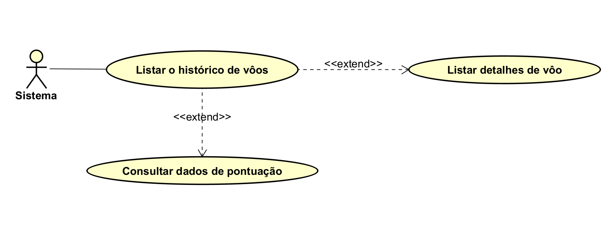
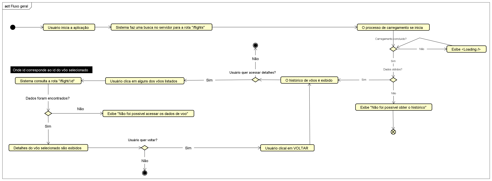
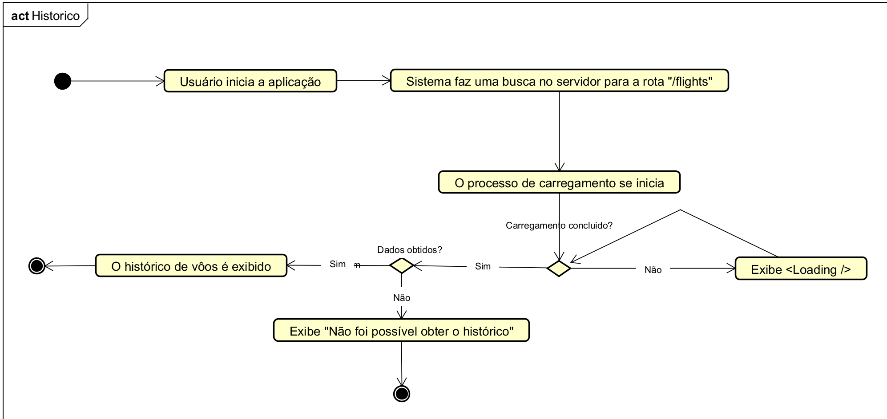
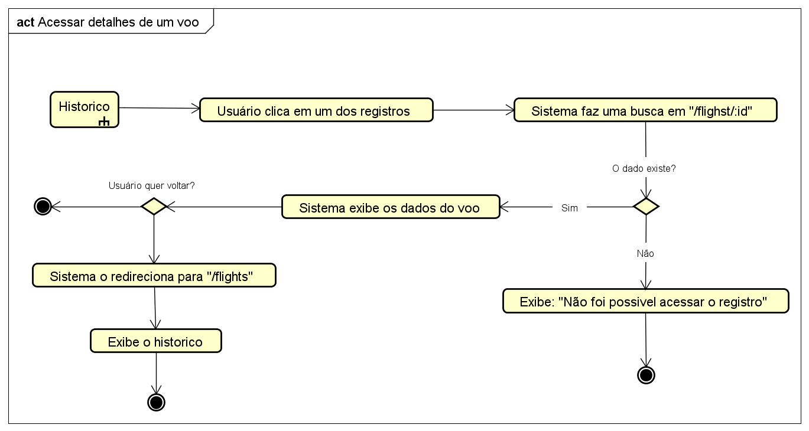
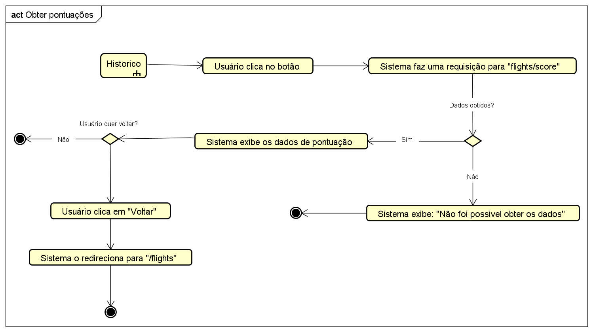

# Front-end [DESAFIO] Pilops
Esse projeto consiste no frontend da aplicação correspondente ao desafio proposto pela empresa **Pilops** para a vaga de Engenheiro de Software Estágio/Junior.

Aqui estarão, além da disponibilização do próprio frontend em si, algumas das decisões técnicas durante a codificação do projeto.

Projeto rodando em: https://frontend-pilops.vercel.app/flights


## Tecnologias utilizadas

- `Node.js` - Ambiente de execução JavaScript no servidor.
- `TypeScript` - Tipagem estática para JavaScript.
- `React` - Biblioteca para construção de interfaces.
- `Vite` - Ferramenta de build rápida para frontend.
- `Material UI` - Biblioteca de componentes UI com design consistente.
- `Axios` - Cliente HTTP para comunicação com backend.
- `React Router` - Gerenciamento de rotas SPA.
- `Prettier` - Padronização de formatação de código.

## Sumário
1. [Como rodar o projeto](#como-rodar-o-projeto)
2. [Funcionalidades](#funcionalidades)
3. [Modelagem](#modelagem)
4. [Decisões técnicas](#decisões-técnicas)
5. [Melhorias futuras](#melhorias-futuras)

## Como rodar o projeto

1. Faça o clone do repopositório

```shell
git clone https://github.com/Leonardobern10/frontend_pilops
```

2. Entre na pasta do projeto
```shell
cd frontend_pilops
```

3. Instale as dependências
```shell
npm install
```

4. Defina as variáveis de ambiente (servidor local)

```shell
VITE_BASE_URL=http://localhost:3000/flights
```

*Criar um arquivo `.env` na raiz do projeto*

5. Execute a aplicação

```shell
npm run dev
```

Acesse: http://localhost:5173

**É necessário que servidor local de aplicação esteja rodando**.

## Funcionalidades

### 1. Acessar histórico: O usuário consegue acessar seu histórico de vôos, exibindo as seguintes métricas:

- aircraft: Dados referentes à aeronave
    - name: Nome da aeronave
    - registration: Registro 
    - airline: Linha área
- flightData: Dados referentes ao registro de vôo
    - date: Data
    - balance: Saldo
    - route: Dados referentes à rota feita
        - from: Partida
        - to: Chegada

   **Exemplo**:

    ```json
    aircraft: {
        name: 'Cessna 172 G1000',
        registration: 'PR-PNK',
        airline: 'Pilops Academy'
        },
    flightData: {
        date: '2025-07-22',
        balance: 1065
        route: { 
            from: 'SBRJ', 
            to: 'SBFZ' 
        },
    }
    ```
### 2. Consultar detalhes de um vôo específico: O usuário consegue, ao acessar em um registro de vôo específico, obter mais detalhes sobre o mesmo. Os dados relatados são:

- aircraft: Dados referentes à aeronave
    - name: Nome da aeronave
    - registration: Registro 
    - airline: Linha área
- flightData: Dados referentes ao registro de vôo
    - date: Data
    - balance: Saldo
    - route: Dados referentes à rota feita
        - from: Partida
        - to: Chegada
    - xp: Pontuação de xp adquirida
    - missionBonus: Pontuação bonus (em porcentagem) adquirida

    **Exemplo:**
    ```json
    aircraft: {
        name: 'Cessna 172 G1000',
        registration: 'PR-PNK',
        airline: 'Pilops Academy'
        },
    flightData: {
        date: '2025-07-22',
        balance: 1065
        route: { 
            from: 'SBRJ', 
            to: 'SBFZ' 
        },
        xp: 445,
        missionBonus: 1
    }
    ```

### 3. Consultar pontuação com base no histórico: O usuário consegue, ao clicar no botão "Consultar pontuação geral", obter dados estatísticos sobre a pontuação com base no seu histórico. As estatísticas são:

- balance: O saldo total obtido da soma de todas as pontuações do usuário
- xp: O sado total obtido da soma de todos xps adquiridos.
- missionBonus: O saldo total de bonus de missão obtidos da soma de todos os bonus adquiridos.
- maxBalance: O registro de vôo de maior pontuação atingida pelo usuário.
- minBalance: O registro de vôo de menor pontuação atingida pelo usuário.

    **Exemplo:**

    ```json
    balance: "189464.87",
    xp: "31781.00",
    missionBonus": "9.65",
    maxBalance: {
        id: "FL-067",
        aircraft: {
        name: "ATR 72",
        registration: "PR-JFT",
        airline: "Pilops Regional"
        },
        flightData: {
            date: "2025-09-09",
            balance: 4943,
            route: {
                "from": "SBSP",
                "to": "SBFZ"
        },
        xp: 125,
        missionBonus": 0.05
        }
    },
    minBalance: {
        id: "FL-006",
        aircraft: {
        name: "Pilatus PC-12",
        registration: "PR-HSP",
        airline: "Pilops Cargo"
        },
        flightData: {
            date: "2025-08-10",
            balance: -4999,
            route: {
                from: "SBME",
                to: "SBSP"
        },
        xp: 402,
        missionBonus: 0.1
        }
    }

## Modelagem
### Casos de uso:


### Fluxo geral


### Histórico



### Detalhes de vôo


### Obter Pontuações



## Decisões técnicas
### Por que utilizar Material UI?
O **Material UI** é um framework para a criação de componentes que permite uma boa centralização da estilização global da aplicação, evitando que estilos aleatórios sejam aplicados e replicados ao sistema. Por meio de seu arquivo `theme.ts` fica facilitado a especificação de design do projeto, como cores, espaçamento, fontes, etc. Podemos citar também sua compatilibilidade e forte integração diversas bibliotecas muito usadas como **React Hook Form**, **Zustand**, etc.

### Porque criar um único componente `DetailFlight`?
Esse componente renderiza um texto que representa o `titulo` daquele conteudo e um outro texto `content`. Esse estilo e formatação correspondem a todas essas informações auxiliares, inclusive o `balance` (saldo), na qual a única diferença é a cor do sald que varia conforme o valor.

Aqui o que foi feito é criar uma propriedade no componente ao qual indica se ele irá receber um `balance` através de um booleano. 

Essa abordagem permite uma padronização do estilo e formatação dominante no projeto, ao passo que gera uma leve personalização independente.

### Por que separar estilos do Material UI com React?
Evita recriação desnecessária de objetos de estilo em cada renderização, melhorando desempenho. Estratégias possíveis:
    - Definir estilos fora do componente.
    - Usar `useMemo` para estilos dependentes de `theme`.
    - Criar componentes com `styled` do Material UI para evitar estilos inline.

### Por que a criação dos hooks personalizados?
Seguem o **SRP (Separação de Responsabilidades)**, isolando lógica de obtenção de dados dos componentes. Isso aumenta legibilidade, reutilização e manutenção de código.

### Por que o arquivo vercel.json?
O arquivo `vercel.json` trata de um erro muito comum no deploy de SPA (Sigle Page Application) hospedades na plataforma (Vercel).

Resolução:
Previe erro comum em **SPAs hospedades na Vercel**, redirecionando todas as rotas desconhecidas para `index.html`, permitindo que o **React Router** cuide do roteamente.

Obs: **Deve estar localizado na raiz do projeto**.

```
{
    "rewrites": [
        { "source": "/(.*)", "destination": "/"}
    ]
}
```

Upgrade: Em melhorias futuras, devemos implementar uma pagina `NotFoundPage` com uma representação e animação, indicando que o usuário busca por uma pagina que não existe, e dar à ele a opção de voltar.

📄 Para detalhes técnicos completos, consulte o arquivo [notations.md](./notations.md).
- Motivação para uso do Material UI
- Estrutura do componente `DetailFlight`
- Função do `ThemeProvider` e `CSSBaseline`
- Estratégias em estilização para melhora de desempenho
- Lógica dos hooks personalizados
- Configuração do arquivo `vercel.json` e como o problema é resolvido

## Melhorias futuras
1. Adição de testes unitários e integração com React Testing Library, e E-2-E (Cypress);
2. Adição de alternância entre temas Claro e Escuro.
3. Adição de animações com Framer Motion (mais simples) ou GSAP (mais complexas).